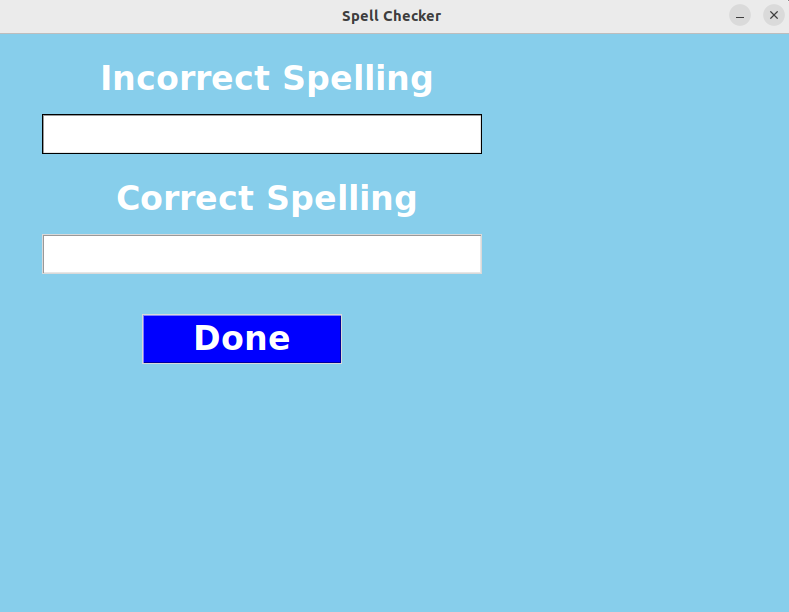

# Spell_checker

Spell Checker Application

This Python-based application provides a simple graphical user interface (GUI) for correcting spelling mistakes. The project uses the TextBlob library to identify and correct misspelled words entered by the user.

Features

User-Friendly Interface: The application offers an intuitive and easy-to-use interface built with Tkinter.
Real-Time Spell Correction: As soon as the user inputs a word or sentence, the application provides the correct spelling using the TextBlob library.

How It Works
1-The user types a word or sentence with potential spelling errors into the "Incorrect Spelling" field.
2-Upon clicking the "Done" button, the application processes the input and displays the corrected spelling in the "Correct Spelling" field.

Usage
1-Enter the text with incorrect spelling in the "Incorrect Spelling" field.
2-Click on the "Done" button to see the corrected spelling displayed in the "Correct Spelling" field.

Contributions are welcome! Please feel free to submit a Pull Request or raise an Issue.

